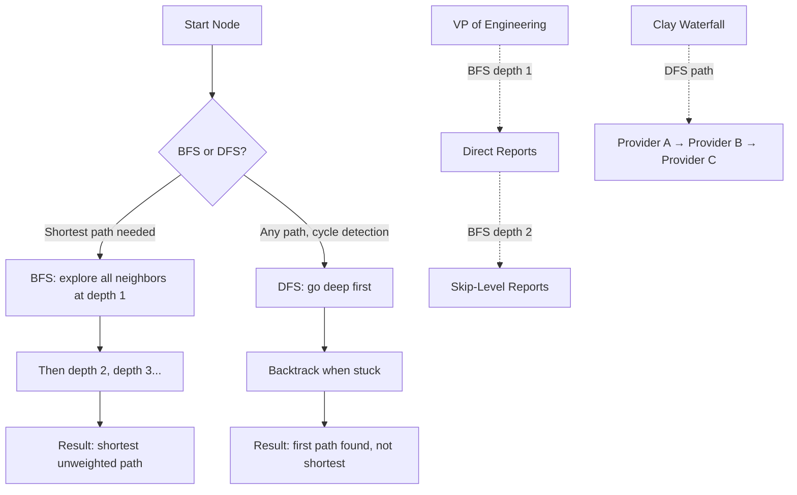

# Graph Theory for Machine Learning

**Type:** Build
**Language:** Python
**Prerequisites:** Linear algebra, matrices, NumPy basics
**Time:** ~90 minutes

## Learning Objectives

- Build graph data structures using adjacency matrices and adjacency lists, and translate between representations
- Implement BFS and DFS traversals and identify when each is appropriate for a given query
- Compute degree, betweenness, and eigenvector centrality on a graph and interpret rankings
- Implement one round of GNN-style message passing as a normalized adjacency matrix multiplication
- Apply graph representations to GTM problems: account similarity, org chart traversal, and enrichment waterfalls

## The Problem

Tables assume rows are independent. Most B2B data isn't. When your ICP scoring ignores that Company A shares a tech stack with Company B, or that Contact X reports to Contact Y, you're leaving signal on the table. Graph theory is the mathematics of relationships — and most revenue data is relational at its core.

Consider what happens when you score accounts using only firmographics. Two companies in the same industry, same size band, same region look identical to a tabular model. But one shares an investor with your best customer, uses three of the same tools, and just hired a VP of Engineering from a company in your existing book. The other doesn't. A tabular model treats them as equal. A graph model doesn't.

Or consider outbound. You're trying to reach the decision-maker for a deal. You know the company uses Slack, you know the Director of IT, and you know that Director reports to a VP of Infrastructure. The tabular approach: look up "VP of Infrastructure" in a directory. The graph approach: traverse the reporting edge from Director to VP, traverse the tool-adoption edge from company to Slack (confirming relevance), and traverse the colleague edge to find peer VPs at adjacent companies. The graph encodes the path; the table encodes a row.

Traditional ML treats data as flat tables. Each row is independent. Each feature is a column. When the structure of connections carries signal — social networks, molecules, knowledge bases, citation networks, org charts, tech stacks — tables fail. Graph Neural Networks (GNNs) address this by learning from both node features and the topology connecting them. Every GNN builds on the same foundation: basic graph theory, matrix representations, and a message-passing abstraction that aggregates neighborhood information.

## The Concept

### Graphs: Nodes and Edges

A graph G = (V, E) consists of vertices (nodes) V and edges E. Each edge connects two nodes. In an undirected graph, edges have no direction — a social graph where "friendship" is symmetric. In a directed graph, edges point from one node to another — an org chart where "reports to" goes from direct-report up to manager, never the reverse. A directed acyclic graph (DAG) adds the constraint that no cycles exist: you can't follow reporting lines and end up back where you started. Org charts are typically DAGs. Tech adoption graphs are typically undirected bipartite graphs (companies connected to technologies, with no company-to-company or tech-to-tech edges).

Edges can carry weights. In a technology adjacency graph, the weight might represent adoption strength — "uses Slack for chat" vs. "has a Slack workspace that one team tried once." In an account similarity graph, the weight might represent how many technologies, investors, or hiring patterns two companies share. Unweighted graphs treat all edges as equal; weighted graphs encode intensity.

### Adjacency Representations

To compute on graphs, you need a matrix representation. Three dominate:

**Adjacency matrix.** An N×N matrix A where A[i][j] = 1 if an edge exists from node i to node j, 0 otherwise. For weighted graphs, A[i][j] = weight. This is mathematically convenient — matrix multiplication on A powers centrality measures, spectral clustering, and message passing. The problem: for a graph with 100,000 nodes and sparse connections (most real graphs), you store 10 billion entries, most of which are zero. This is why adjacency matrices appear in algorithm explanations but rarely in production graph databases.

**Adjacency list.** For each node, store a list of its neighbors. Space is O(V + E), not O(V²). This is what NetworkX, Neo4j, and most production systems use internally. The tradeoff: matrix operations (like the ones powering GNN message passing) require reconstructing the matrix, so frameworks like PyTorch Geometric store sparse tensors that combine both worlds.

**Edge list.** A flat list of (source, target, weight) tuples. Simple to serialize, terrible for querying "who are node i's neighbors?" without building an index. Useful as an interchange format.

### Traversal: BFS and DFS

Graph traversal is the "for loop" of graph computation — you need it to explore structure, find paths, and propagate information.

**Breadth-First Search (BFS)** explores all neighbors at the current depth before moving deeper. It finds shortest paths in unweighted graphs. In a GTM context, BFS from a VP node through reporting edges finds direct reports first (depth 1), then skip-level reports (depth 2). This is the algorithm for "find everyone in this person's org."

**Depth-First Search (DFS)** goes as deep as possible before backtracking. It's better for finding any path quickly, detecting cycles, and topological sorting. In a GTM context, DFS on an enrichment waterfall graph explores one provider path fully before trying alternatives — which is exactly how a Clay waterfall evaluates data providers in sequence.



### Centrality: Who Matters?

Centrality measures answer "which nodes are important?" — but different definitions of "important" produce different rankings.

**Degree centrality** counts edges. A node with 15 connections has higher degree centrality than one with 3. Simple, fast, and often sufficient. In a company-technology bipartite graph, companies with high degree centrality adopt many technologies — they might be early adopters worth targeting.

**Betweenness centrality** counts how often a node appears on shortest paths between other nodes. High-betweenness nodes are bridges — remove them and the graph fragments. In an org chart, the Chief of Staff might have low degree centrality (few direct reports) but high betweenness (they're on the communication path between many pairs of people). In an account graph, a company that connects two otherwise separate clusters is a high-leverage reference.

**Eigenvector centrality** measures importance recursively: a node is important if it's connected to important nodes. This is the intuition behind Google's PageRank. In a B2B context, an account connected to other high-value accounts (shared investors, shared tech, shared hires) gets high eigenvector centrality — it's in a dense neighborhood of signal-rich nodes.

### The Laplacian and Spectral Methods

The graph Laplacian is L = D - A, where D is the degree diagonal matrix and A is the adjacency matrix. The Laplacian's eigenvalues reveal structural properties: the number of zero eigenvalues equals the number of connected components. The second-smallest eigenvalue (the Fiedler value) and its eigenvector (the Fiedler vector) enable spectral clustering — partitioning the graph into communities by sign of the Fiedler vector entries. This is how you discover account clusters without predefined segments.

### Message Passing: The GNN Mechanism

A Graph Neural Network updates each node's representation by aggregating information from its neighbors. One round of message passing works like this: for each node, collect its neighbors' feature vectors, combine them (sum, mean, or max), apply a linear transformation, and that becomes the node's new representation. After k rounds, each node has absorbed information from its k-hop neighborhood.

In matrix form, this is H' = σ(D̂⁻¹ᐟ²  D̂⁻¹ᐟ² H W), where  = A + I (adjacency plus self-loops), D̂ is the degree matrix of Â, H is the node feature matrix, W is a learnable weight matrix, and σ is a nonlinearity. The normalized adjacency term D̂⁻¹ᐟ²  D̂⁻¹ᐟ² is the key — it scales each node's contribution by its degree, so high-degree nodes don't dominate. This single matrix multiplication IS one layer of a Graph Convolutional Network (GCN).

## Build It

Let's build graphs, compute centrality, and implement message passing — all in runnable Python.

### Build and Query a Graph

```python
import networkx as nx

G = nx.DiGraph()

G.add_node("VP_Eng", role="VP", level=2)
G.add_node("Dir_Platform", role="Director", level=1)
G.add_node("Dir_Security", role="Director", level=1)
G.add_node("Eng_Mgr_1", role="Manager", level=0)
G.add_node("Eng_Mgr_2", role="Manager", level=0)
G.add_node("Sec_Analyst", role="IC", level=0)

G.add_edge("Dir_Platform", "VP_Eng", relation="reports_to")
G.add_edge("Dir_Security", "VP_Eng", relation="reports_to")
G.add_edge("Eng_Mgr_1", "Dir_Platform", relation="reports_to")
G.add_edge("Eng_Mgr_2", "Dir_Platform", relation="reports_to")
G.add_edge("Sec_Analyst", "Dir_Security", relation="reports_to")

print("Nodes:", list(G.nodes()))
print("Edges:", list(G.edges(data=True)))
print("\nDegree of VP_Eng:", G.degree("VP_Eng"))
print("In-degree of VP_Eng:", G.in_degree("VP_Eng"))
print("Out-degree of VP_Eng:", G.out_degree("VP_Eng"))

print("\nPredecessors of VP_Eng (direct reports):", list(G.predecessors("VP_Eng")))
print("Predecessors of Dir_Platform (direct reports):", list(G.predecessors("Dir_Platform")))

path = nx.shortest_path(G, source="Eng_Mgr_1", target="VP_Eng")
print("\nShortest path from Eng_Mgr_1 to VP_Eng:", path)

bfs_tree = nx.bfs_tree(G, source="VP_Eng", reverse=True)
print("\nBFS from VP_Eng (reverse = down the tree):")
for node in bfs_tree:
    depth = nx.shortest_path_length(G, source=node, target="VP_Eng")
    print(f"  {'  ' * depth}{node} (depth {depth})")
```

### Compute Centrality on a B2B Graph

```python
import networkx as nx

G = nx.Graph()

companies = ["Acme", "Globex", "Initech", "Umbra", "Stark", "Wayne"]
techs = ["Slack", "AWS", "Snowflake", "Segment", "Salesforce", "Datadog"]

G.add_nodes_from(companies, bipartite=0)
G.add_nodes_from(techs, bipartite=1)

adoption_edges = [
    ("Acme", "Slack"), ("Acme", "AWS"), ("Acme", "Snowflake"), ("Acme", "Segment"),
    ("Globex", "Slack"), ("Globex", "AWS"), ("Globex", "Datadog"),
    ("Initech", "AWS"), ("Initech", "Snowflake"), ("Initech", "Salesforce"),
    ("Umbra", "Slack"), ("Umbra", "Snowflake"), ("Umbra", "Segment"), ("Umbra", "Datadog"),
    ("Stark", "AWS"), ("Stark", "Salesforce"), ("Stark", "Datadog"),
    ("Wayne", "Slack"), ("Wayne", "Segment"),
]
G.add_edges_from(adoption_edges)

print("=== DEGREE CENTRALITY ===")
degree_cent = nx.degree_centrality(G)
for node, cent in sorted(degree_cent.items(), key=lambda x: -x[1]):
    print(f"  {node:15s}  {cent:.3f}  (degree={G.degree(node)})")

print("\n=== BETWEENNESS CENTRALITY ===")
between_cent = nx.betweenness_centrality(G)
for node, cent in sorted(between_cent.items(), key=lambda x: -x[1]):
    print(f"  {node:15s}  {cent:.3f}")

print("\n=== EIGENVECTOR CENTRALITY ===")
eigen_cent = nx.eigenvector_centrality(G)
for node, cent in sorted(eigen_cent.items(), key=lambda x: -x[1]):
    print(f"  {node:15s}  {cent:.3f}")

print("\n=== COMPANY-COMPANY SIMILARITY (shared tech neighbors) ===")
for c1 in companies:
    for c2 in companies:
        if c1 < c2:
            shared = set(G.neighbors(c1)) & set(G.neighbors(c2))
            if shared:
                print(f"  {c1} <-> {c2}: {len(shared)} shared ({', '.join(sorted(shared))})")
```

### Manual Message Passing with NumPy

This is the mechanism behind every GNN — one round of normalized neighborhood aggregation as a matrix operation. No framework, just linear algebra.

```python
import numpy as np

nodes = ["Acme", "Globex", "Initech", "Umbra"]
node_features = np.array([
    [1.0, 0.0, 0.0],
    [0.0, 1.0, 0.0],
    [0.0, 0.0, 1.0],
    [0.5, 0.5, 0.0],
])

A = np.array([
    [0, 1, 1, 1],
    [1, 0, 1, 0],
    [1, 1, 0, 1],
    [1, 0, 1, 0],
], dtype=float)

A_hat = A + np.eye(4)

D_hat = np.diag(A_hat.sum(axis=1))
print("Degree matrix D_hat diagonal:", D_hat.diagonal())

D_hat_inv_sqrt = np.diag(1.0 / np.sqrt(A_hat.sum(axis=1)))

normalized_adj = D_hat_inv_sqrt @ A_hat @ D_hat_inv_sqrt
print("\nNormalized adjacency (D^-1/2 * A_hat * D^-1/2):")
print(np.round(normalized_adj, 3))

print("\nOriginal node features H:")
print(node_features)

W = np.array([
    [1.0, 0.5, -0.3],
    [0.2, 1.0, 0.4],
    [-0.5, 0.3, 1.0],
])

H_new = normalized_adj @ node_features @ W
print("\nH' = normalized_adj @ H @ W (one round of message passing):")
print(np.round(H_new, 3))

print("\nDifference (how much each node's representation changed):")
print(np.round(H_new - node_features @ W, 3))

print("\n--- Interpretation ---")
for i, node in enumerate(nodes):
    neighbors = [nodes[j] for j in range(len(nodes)) if A[i][j] == 1]
    print(f"{node}: aggregated info from {neighbors}")
    print(f"  Before: {np.round(node_features[i], 2)}")
    print(f"  After:  {np.round(H_new[i], 2)}")
```

Run this and you'll see each node's representation shift toward the weighted average of its neighbors' features. That shift — that absorption of neighborhood signal — is the entire mechanism of a Graph Convolutional Network. Every GNN layer in PyTorch Geometric or DGL does this same operation with a learned weight matrix and backpropagation through the gradients.

## Use It

This Python environment is where you'll run Clay webhooks, Apollo API calls, and enrichment waterfalls. Graph methods apply directly to GTM problems that tabular methods mishandle. The four mechanisms below map graph theory to specific revenue engineering tasks.

### Account Similarity Graphs

Companies sharing technologies, investors, or hiring patterns form a weighted graph. Node similarity on this graph surfaces lookalike accounts that firmographic filters miss. The mechanism: construct a company-technology bipartite graph, project it to a company-company graph where edge weight = number of shared technologies, then use eigenvector centrality or community detection to find dense clusters of similar accounts. This is graph-based lookalike modeling — the same math that powers social recommendation systems, applied to your TAM. [CITATION NEEDED — concept: graph-based lookalike modeling in account scoring]

```python
import networkx as nx

G = nx.Graph()

best_customers = ["Acme", "Umbra", "Initech"]
prospects = ["Globex", "Stark", "Wayne", "Hooli"]

tech_adopters = {
    "Acme": ["Slack", "AWS", "Snowflake", "Segment", "Datadog"],
    "Umbra": ["Slack", "Snowflake", "Segment", "Datadog", "Salesforce"],
    "Initech": ["AWS", "Snowflake", "Salesforce", "Datadog"],
    "Globex": ["Slack", "AWS", "Datadog"],
    "Stark": ["AWS", "Salesforce", "Datadog", "Snowflake"],
    "Wayne": ["Slack", "Segment"],
    "Hooli": ["AWS", "Slack", "Snowflake"],
}

for company, techs in tech_adopters.items():
    is_customer = company in best_customers
    G.add_node(company, customer=is_customer)
    for tech in techs:
        G.add_node(tech, customer=False)
        G.add_edge(company, tech)

projected = nx.bipartite.weighted_projected_graph(G, list(tech_adopters.keys()))

print("=== PROSPECT-CUSTOMER SIMILARITY SCORES ===")
scores = []
for prospect in prospects:
    for customer in best_customers:
        if projected.has_edge(prospect, customer):
            weight = projected[prospect][customer]["weight"]
            scores.append((prospect, customer, weight))

for prospect, customer, weight in sorted(scores, key=lambda x: -x[2]):
    print(f"  {prospect:10s} <-> {customer:10s}  shared_tech={weight}")

print("\n=== TOP PROSPECTS BY CUSTOMER OVERLAP ===")
prospect_scores = {}
for prospect in prospects:
    total = 0
    for customer in best_customers:
        if projected.has_edge(prospect, customer):
            total += projected[prospect][customer]["weight"]
    prospect_scores[prospect] = total

for prospect, score in sorted(prospect_scores.items(), key=lambda x: -x[1]):
    print(f"  {prospect:10s}  total_shared_tech={score}")

print("\n=== COMMUNITY DETECTION (spectral bisection) ===")
communities = nx.community.greedy_modularity_communities(projected)
for i, comm in enumerate(communities):
    print(f"  Cluster {i+1}: {sorted(comm)}")
```

### Org Chart Traversal for Multi-Threaded Outbound

Multi-threaded outbound requires mapping reporting lines. This is a directed graph traversal — BFS from a VP node through `reports_to` edges to find directs, skip-level directs, and peer VPs. The graph structure tells you exactly who to CC, who to escalate to, and who the economic buyer likely is based on reporting depth.

```python
import networkx as nx
from collections import deque

org = nx.DiGraph()

edges = [
    ("CEO", None),
    ("CTO", "CEO"),
    ("VP_Eng", "CTO"),
    ("VP_Infra", "CTO"),
    ("Dir_Platform", "VP_Eng"),
    ("Dir_Security", "VP_Infra"),
    ("Eng_Mgr_1", "Dir_Platform"),
    ("Eng_Mgr_2", "Dir_Platform"),
    ("Sec_Analyst", "Dir_Security"),
    ("SRE_Lead", "VP_Infra"),
]

for node, manager in edges:
    org.add_node(node)
    if manager:
        org.add_edge(node, manager, relation="reports_to")

def find_org_tree(graph, root, max_depth=3):
    result = {0: [root]}
    visited = {root}
    queue = deque([(root, 0)])
    
    while queue:
        current, depth = queue.popleft()
        if depth >= max_depth:
            continue
        reports = [n for n in graph.predecessors(current) if n not in visited]
        if reports:
            next_depth = depth + 1
            if next_depth not in result:
                result[next_depth] = []
            for r in reports:
                if r not in visited:
                    result[next_depth].append(r)
                    visited.add(r)
                    queue.append((r, next_depth))
    return result

print("=== ORG TREE FROM VP_Eng (BFS traversal) ===")
tree = find_org_tree(org, "VP_Eng")
for depth in sorted(tree.keys()):
    indent = "  " * depth
    for person in tree[depth]:
        print(f"{indent}[depth {depth}] {person}")

print("\n=== ESCALATION PATH FROM Eng_Mgr_1 ===")
path = nx.shortest_path(org, source="Eng_Mgr_1", target="CEO")
print("  " + " -> ".join(path))

print("\n=== PEER VPs (same manager level) ===")
vp_eng_manager = list(org.successors("VP_Eng"))
for node in org.nodes():
    if node != "VP_Eng" and any(org.has_edge(node, m) for m in vp_eng_manager):
        print(f"  Peer: {node}")
```

### Enrichment Waterfall as Graph Traversal

A Clay waterfall enrichment sequence is a path through data provider nodes. Each provider is a node; the edges are "fallback" relationships. Modeling the waterfall as a directed graph lets you reason about traversal order, cost (edge weights = API cost per call), and coverage (which providers resolve which attributes). The message-passing concept from GNNs directly informs how enrichment propagates: each provider node "passes" whatever attributes it found to the next node in the path, aggregating signal as it goes.

[CITATION NEEDED — concept: modeling enrichment waterfalls as directed graph traversal in Clay]

```python
import networkx as nx

waterfall = nx.DiGraph()

waterfall.add_node("start", type="entry")
waterfall.add_node("apollo", type="provider", cost=0.05, covers=["email", "title"])
waterfall.add_node("zoominfo", type="provider", cost=0.12, covers=["email", "phone", "title"])
waterfall.add_node("clearbit", type="provider", cost=0.03, covers=["company_domain", "industry"])
waterfall.add_node("hunter", type="provider", cost=0.02, covers=["email"])
waterfall.add_node("end", type="terminal")

waterfall.add_edge("start", "apollo", fallback_for=["email", "title"])
waterfall.add_edge("start", "clearbit", fallback_for=["company_domain", "industry"])
waterfall.add_edge("apollo", "zoominfo", fallback_for=["phone"])
waterfall.add_edge("apollo", "hunter", fallback_for=["email"])
waterfall.add_edge("zoominfo", "end", fallback_for=[])
waterfall.add_edge("clearbit", "end", fallback_for=[])
waterfall.add_edge("hunter", "end", fallback_for=[])

print("=== ENRICHMENT WATERFALL GRAPH ===")
for node, data in waterfall.nodes(data=True):
    if data.get("type") == "provider":
        print(f"  Provider: {node:12s}  cost=${data['cost']:.2f}/call  covers={data['covers']}")

print("\n=== ALL PATHS FROM start TO end ===")
for path in nx.all_simple_paths(waterfall, source="start", target="end"):
    cost = sum(waterfall.nodes[n].get("cost", 0) for n in path)
    labels = [n for n in path if waterfall.nodes[n].get("type") == "provider"]
    print(f"  {' -> '.join(path)}  (provider cost: ${cost:.2f})")

print("\n=== CHEAPEST PATH (minimum cost traversal) ===")
paths = list(nx.all_simple_paths(waterfall, source="start", target="end"))
path_costs = [(p, sum(waterfall.nodes[n].get("cost", 0) for n in p)) for p in paths]
cheapest = min(path_costs, key=lambda x: x[1])
print(f"  Path: {' -> '.join(cheapest[0])}")
print(f"  Cost: ${cheapest[1]:.2f}")

print("\n=== ATTRIBUTE COVERAGE MAP ===")
needed = ["email", "phone", "title", "company_domain", "industry"]
for attr in needed:
    providers = [n for n, d in waterfall.nodes(data=True) if attr in d.get("covers", [])]
    print(f"  {attr:20s} -> {providers}")
```

## Ship It

In production, the graph representations from this lesson connect directly to your GTM stack. The Python environment running these scripts is the same one that handles Clay webhook payloads, Apollo API responses, and enrichment pipeline logic. Here's how the pieces connect.

**Account scoring pipeline.** The company-technology bipartite graph from "Use It" becomes a pre-processing step in your scoring model. Instead of one-hot encoding "uses Slack: yes/no," you compute graph-derived features: eigenvector centrality in the tech-adoption graph, community membership labels from spectral clustering, shortest-path distance to your top 10 customers. These features feed into whatever classifier you use for ICP scoring — XGBoost, logistic regression, or a neural network. The graph features capture relational signal that firmographic columns cannot.

**Enrichment optimization.** The waterfall-as-graph model lets you optimize provider order by cost and coverage. Instead of hardcoding "try Apollo first, then ZoomInfo," you compute the minimum-cost path through the provider graph that covers all required attributes. When a provider changes pricing or adds new attribute coverage, you update the edge weights and recompute — the traversal logic stays the same. This is a direct application of shortest-path algorithms to enrichment cost optimization. [CITATION NEEDED — concept: dynamic enrichment provider ordering based on graph traversal cost optimization]

**Org chart routing.** When a Clay enrichment webhook returns a contact's title and company, you query your org chart graph to find their reporting chain. If the contact is an IC at depth 3, you traverse upward to find the VP at depth 1 and the manager at depth 2. This determines your multi-threaded outreach sequence: contact the IC, CC the manager, reference the VP's priorities in the email. The graph traversal happens in the webhook handler — same Python environment, same NetworkX objects, production data.

The Zone 1 (TAM Mapping) and Zone 2 (Enrichment) workflows assume you can represent relationships as graphs, traverse them efficiently, and extract features from their structure. That's what this lesson provides. The next step is wiring these graph operations into actual Clay tables, Apollo lookups, and CRM sync — but the mathematical foundation is here.

## Exercises

**Easy.** Modify the centrality example. Add a new company "TestCorp" that adopts only 1 technology. Recompute all three centrality measures. Observe how its rankings change across degree, betweenness, and eigenvector centrality. Write one sentence explaining why the rankings differ.

**Medium.** Extend the org chart graph with 5 new nodes (add a VP of Data with two direct reports and one IC under each). Implement a function `find_multi_thread_targets(graph, contact_node)` that returns: (1) the contact's manager, (2) the contact's skip-level manager, (3) any peer ICs at the same depth. Print the results for at least two different starting contacts.

**Hard.** Implement weighted message passing. Start with the NumPy message-passing example. Add edge weights to the adjacency matrix (representing relationship strength — e.g., shared technologies count). Implement two rounds of message passing with a learnable-looking aggregation: H₁ = σ(norm_adj @ H₀ @ W₁), then H₂ = σ(norm_adj @ H₁ @ W₂). Use `np.tanh` as σ. Initialize W₁ and W₂ randomly. Print the node representations after each round and compute the cosine similarity matrix between all node pairs after round 2. The similarity matrix should reflect graph structure — nodes connected by high-weight edges should have higher cosine similarity.

## Key Terms

- **Graph (G = (V, E))** — A data structure of vertices (nodes) and edges connecting them. The fundamental representation for relational data.
- **Directed vs. undirected graph** — Directed edges have direction (org chart: "reports to"). Undirected edges are symmetric (friendship, co-adoption).
- **Bipartite graph** — A graph with two node types where edges only connect across types (companies × technologies). Projection collapses one type to reveal relationships in the other.
- **Adjacency matrix (A)** — N×N matrix where A[i][j] encodes the edge between nodes i and j. Convenient for computation, space-inefficient for sparse graphs.
- **Adjacency list** — Per-node list of neighbors. Space-efficient, used in most production graph systems.
- **BFS (Breadth-First Search)** — Traversal exploring all neighbors at current depth before going deeper. Finds shortest unweighted paths.
- **DFS (Depth-First Search)** — Traversal going deep before backtracking. Finds any path, detects cycles.
- **Degree centrality** — Node importance by edge count. Simple count of connections.
- **Betweenness centrality** — Node importance by how often it appears on shortest paths between other node pairs. Measures "bridge" importance.
- **Eigenvector centrality** — Node importance by connection to other important nodes. Recursive definition; basis of PageRank.
- **Graph Laplacian (L = D − A)** — Degree matrix minus adjacency matrix. Its eigenvalues reveal connected components and community structure.
- **Spectral clustering** — Partitioning a graph using eigenvectors of the Laplacian. The Fiedler vector (second-smallest eigenvector) separates communities by sign.
- **Message passing** — GNN operation where each node aggregates neighbor features. One round = one normalized adjacency matrix multiplication. After k rounds, each node absorbs its k-hop neighborhood.
- **GCN (Graph Convolutional Network)** — GNN variant using normalized adjacency matrix multiplication as its core layer operation.

## Sources

- NetworkX documentation: graph creation, traversal, centrality measures — https://networkx.org/documentation/stable/
- Kipf & Welling, "Semi-Supervised Classification with Graph Convolutional Networks" (2016) — defines the normalized adjacency message-passing operation used in the Build It section
- [CITATION NEEDED — concept: graph-based lookalike modeling in account scoring]
- [CITATION NEEDED — concept: modeling enrichment waterfalls as directed graph traversal in Clay]
- [CITATION NEEDED — concept: dynamic enrichment provider ordering based on graph traversal cost optimization]
- Zone 1 (TAM Mapping) and Zone 2 (Enrichment) workflow context: GTM engineering curriculum, outbound foundation module