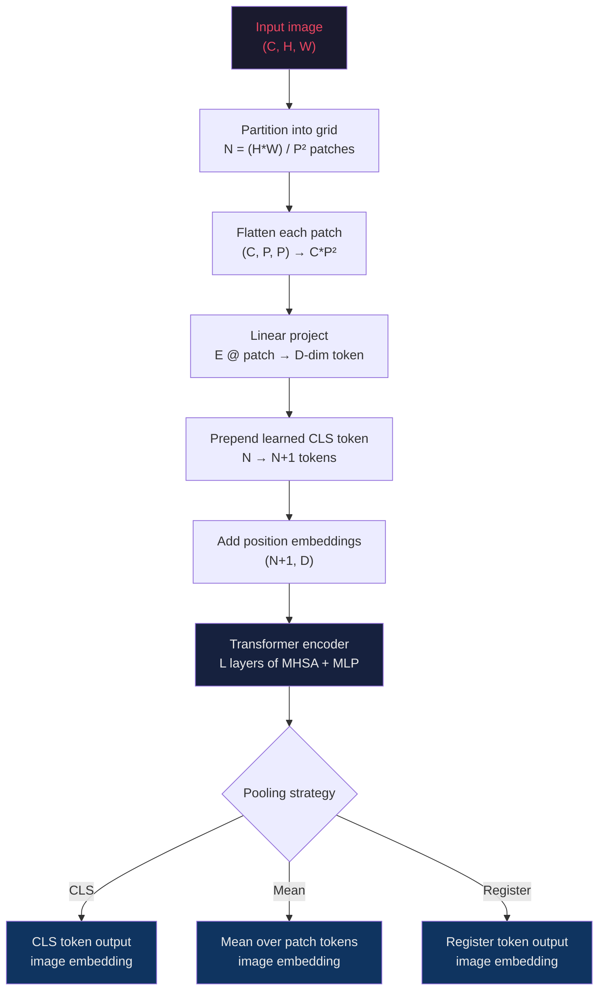

# Vision Transformers and the Patch-Token Primitive

## Learning Objectives

- **Implement** a patch-token pipeline in PyTorch that converts an `(H, W, C)` image into a sequence of `N + 1` transformer-ready tokens with position embeddings.
- **Compute** sequence length, parameter count, and approximate FLOPs for a ViT given `(patch_size, resolution, hidden_dim, depth)`.
- **Trace** the six-stage transformation from raw pixels through the transformer encoder to a pooled image embedding.
- **Compare** CLS pooling, mean pooling, and register-token pooling on the same backbone for downstream classification.
- **Configure** a SigLIP or DINOv2 embedding call against a corpus of company logos and produce cosine-similarity rankings that surface competitor lookalikes.

---

## The Problem

Transformers operate on sequences of vectors. Text is already a sequence — bytes or subword tokens. An image is a 2D grid of pixels across three color channels, and that grid is not a sequence. If you naively flatten every pixel into its own token, a 224×224 RGB image becomes 150,528 tokens, and self-attention is quadratic in sequence length. That single forward pass would burn more memory than a 32k-context language model. The geometry has to collapse somehow.

Pre-2020 solutions bolted a convolutional front-end onto the transformer. ResNet-50 produces a 7×7 feature map of 2048-dim vectors, you feed those 49 tokens to a standard encoder, and it works. But you inherit the CNN's inductive biases — local receptive fields, translation equivariance, a fixed hierarchy of scales — and you lose the thing transformers are good at, which is scaling aggressively with data and compute. The CNN is doing the heavy lifting; the transformer is a fancy classifier head.

The ViT paper (Dosovitskiy et al., 2020) asked a different question: what if you skip the CNN entirely and tokenize the image the same way BPE tokenizes text? The answer was the patch-token primitive. An image gets chopped into a grid of 16×16 patches, each patch gets flattened and linearly projected into a token vector, a position embedding tells the transformer where each patch came from, and the rest is a vanilla encoder. No convolutions, no inductive bias for locality, no receptive-field hierarchy. Five years later the primitive has survived DINO, MAE, SigLIP, SigLIP 2, and the vision towers inside every frontier multimodal model — Claude's vision encoder, Gemini's, Qwen-VL's. The encoders changed; the patch-token front-end did not.

The reason this matters for anyone building enrichment pipelines: a logo, a landing-page screenshot, or a PDF is a 2D grid of pixels. Before you can embed it, cluster it, or classify it, it has to become a sequence of vectors. The patch-token primitive is the only mechanism in production that does this at scale. Every "embed this image and find similar companies" workflow you build on top of SigLIP or CLIP is downstream of this one architectural decision.

---

## The Concept

The patch embedding pipeline has six stages, and every ViT-derivative in production runs some variant of them.

**Stage 1 — Partition.** The input image has shape `(C, H, W)`. Divide it into a grid of non-overlapping patches, each `P × P` pixels. This produces `N = (H · W) / P²` patches. For a 224×224 image with `P = 16`, that's `N = 196` patches. The choice of `P` is the single biggest knob: smaller patches mean more tokens, finer spatial resolution, and quadratically more attention compute.

**Stage 2 — Flatten.** Each patch tensor of shape `(C, P, P)` is reshaped into a vector of length `C · P²`. For RGB at `P = 16`, that's `3 · 256 = 768` numbers per patch. This is the "geometric tokenization" step — unlike BPE, which uses a learned vocabulary, the partition is fixed by the grid.

**Stage 3 — Linear project.** A learned projection matrix `E ∈ ℝ^{D × (C·P²)}` maps each flattened patch to a `D`-dimensional token, where `D` is the transformer's hidden size. This is mathematically identical to a word-embedding lookup — it's a single matrix multiply. In PyTorch it's conventionally implemented as a `Conv2d` with kernel and stride both equal to `P`, because the convolution computes the same operation faster on GPU. The output is a sequence of `N` token vectors.

**Stage 4 — Prepend CLS.** A learned `<CLS>` token vector is prepended to the sequence. After the encoder runs, this token's final hidden state is used as the pooled image representation. The sequence is now length `N + 1`.

**Stage 5 — Add position.** Learned position embeddings of shape `(N + 1, D)` are added element-wise to every token. Without these, the encoder has no spatial information — attention is permutation-equivariant, so two logos with the same patches in different positions would produce identical outputs. Modern variants (SigLIP 2, NaViT) use 2D-RoPE or factorized positions; the original ViT used a flat learned table.

**Stage 6 — Encode.** The `N + 1` tokens pass through a standard transformer encoder — multi-head self-attention, MLP, residual connections, layer norm. Nothing about the encoder changes between ViT and BERT except the input modality.



**Why ViT underperforms ResNet at small data and overtakes it at scale.** CNNs bake in two priors: locality (each neuron sees only a small region) and translation equivariance (a cat in the top-left produces the same features as a cat in the bottom-right). These priors are why ResNet-50 trains well on ImageNet's 1.3M images. ViT has neither prior — attention is fully global from layer one. The model has to learn spatial structure from data. On 1.3M images, ResNet wins. On 300M images (JFT-300M, the original ViT pretraining set), ViT overtakes because the priors stop helping and start constraining. In the limit, the less-biased architecture wins.

**Three upgrades that took ViT from 2020 research to 2026 production.** First, self-supervised pretraining: DINO (2021) and MAE (2022) replaced supervised ImageNet pretraining with masked-patch reconstruction and student-teacher distillation, producing embeddings that transfer to any downstream task without labels. Second, register tokens: DINOv2 (2023) added 4 extra learned tokens (like CLS but plural) to absorb high-norm artifacts that polluted patch outputs. Third, native-resolution packing: NaViT (2023) and SigLIP 2 (2025) process images at their native aspect ratio by packing variable-length patch sequences into batches, dropping the fixed 224×224 constraint that wasted compute on padded borders.

**Key comparison to NLP transformers.** In text, tokenization is discrete (BPE, WordPiece, SentencePiece) — the vocabulary is a learned lookup table. In vision, tokenization is geometric (fixed grid partition followed by linear projection). The rest of the architecture is byte-identical: same attention, same MLP, same residual structure, same layer norm. This is why a single library — Hugging Face `transformers` — serves both modalities.

---

## Build It

Build the patch-token pipeline from scratch in PyTorch. Every shape gets printed so you can confirm the mechanism stage by stage.

```python
import torch
import torch.nn as nn

torch.manual_seed(42)

image_channels = 3
image_height = 224
image_width = 224
patch_size = 16
hidden_dim = 768

num_patches = (image_height // patch_size) * (image_width // patch_size)
print(f"num_patches = {num_patches}")

image = torch.randn(1, image_channels, image_height, image_width)
print(f"image shape = {tuple(image.shape)}")

proj = nn.Conv2d(
    in_channels=image_channels,
    out_channels=hidden_dim,
    kernel_size=patch_size,
    stride=patch_size,
)

patch_embeddings = proj(image)
print(f"after conv projection = {tuple(patch_embeddings.shape)}")

patch_embeddings = patch_embeddings.flatten(2).transpose(1, 2)
print(f"after flatten + transpose = {tuple(patch_embeddings.shape)}")

cls_token = nn.Parameter(torch.zeros(1, 1, hidden_dim))
nn.init.trunc_normal_(cls_token, std=0.02)

batch_size = image.shape[0]
cls_tokens = cls_token.expand(batch_size, -1, -1)
tokens = torch.cat([cls_tokens, patch_embeddings], dim=1)
print(f"after CLS prepend = {tuple(tokens.shape)}")

position_embeddings = nn.Parameter(torch.zeros(1, num_patches + 1, hidden_dim))
nn.init.trunc_normal_(position_embeddings, std=0.02)

tokens = tokens + position_embeddings
print(f"after position add = {tuple(tokens.shape)}")

print(f"CLS token norm before encoder = {tokens[0, 0].norm().item():.4f}")
print(f"patch[0] token norm before encoder = {tokens[0, 1].norm().item():.4f}")
print(f"patch[100] token norm before encoder = {tokens[0, 100].norm().item():.4f}")
```

Run it and you'll see the sequence grow from 196 patch tokens to 197 (with CLS prepended), each 768-dimensional — exactly the input a transformer encoder expects.

Now bolt on a minimal encoder and verify that the CLS token output changes as the sequence flows through attention. This confirms the tokens are actually being processed, not just stored.

```python
import torch
import torch.nn as nn

torch.manual_seed(42)

class MiniViT(nn.Module):
    def __init__(self, image_size=224, patch_size=16, in_channels=3, hidden_dim=768, num_heads=12, num_layers=4):
        super().__init__()
        self.num_patches = (image_size // patch_size) ** 2
        self.patch_proj = nn.Conv2d(in_channels, hidden_dim, kernel_size=patch_size, stride=patch_size)
        self.cls_token = nn.Parameter(torch.zeros(1, 1, hidden_dim))
        self.pos_embed = nn.Parameter(torch.zeros(1, self.num_patches + 1, hidden_dim))
        nn.init.trunc_normal_(self.cls_token, std=0.02)
        nn.init.trunc_normal_(self.pos_embed, std=0.02)
        encoder_layer = nn.TransformerEncoderLayer(
            d_model=hidden_dim,
            nhead=num_heads,
            dim_feedforward=hidden_dim * 4,
            dropout=0.0,
            batch_first=True,
            norm_first=True,
        )
        self.encoder = nn.TransformerEncoder(encoder_layer, num_layers=num_layers)
        self.norm = nn.LayerNorm(hidden_dim)

    def forward(self, x):
        b = x.shape[0]
        patches = self.patch_proj(x).flatten(2).transpose(1, 2)
        cls = self.cls_token.expand(b, -1, -1)
        tokens = torch.cat([cls, patches], dim=1) + self.pos_embed
        tokens = self.encoder(tokens)
        tokens = self.norm(tokens)
        return tokens

model = MiniViT(num_layers=4)
total_params = sum(p.numel() for p in model.parameters())
print(f"total params = {total_params:,}")

image = torch.randn(2, 3, 224, 224)
with torch.no_grad():
    output = model(image)

print(f"input batch = {tuple(image.shape)}")
print(f"output tokens = {tuple(output.shape)}")
print(f"CLS output[0] first 8 dims = {output[0, 0, :8].tolist()}")
print(f"CLS output[0] norm = {output[0, 0].norm().item():.4f}")
print(f"patch[50] output[0] norm = {output[0, 50, :].norm().item():.4f}")
print(f"mean-pool[0] norm = {output[0, 1:].mean(dim=0).norm().item():.4f}")

cls_pool = output[:, 0, :]
mean_pool = output[:, 1:, :].mean(dim=1)
cosine = torch.nn.functional.cosine_similarity(cls_pool, mean_pool, dim=-1)
print(f"cosine(CLSpool, meanpool) per sample = {cosine.tolist()}")

conv_params = sum(p.numel() for p in model.patch_proj.parameters())
cls_params = model.cls_token.numel()
pos_params = model.pos_embed.numel()
encoder_params = sum(p.numel() for p in model.encoder.parameters())
norm_params = sum(p.numel() for p in model.norm.parameters())
print(f"patch_proj params = {conv_params:,}")
print(f"cls_token params = {cls_params}")
print(f"pos_embed params = {pos_params:,}")
print(f"encoder params = {encoder_params:,}")
print(f"final layernorm params = {norm_params}")
```

The cosine similarity between CLS-pooled and mean-pooled outputs is typically near zero on random init — they encode different summaries of the same image. That gap is real and it's why pooling-strategy choice matters downstream.

---

## Use It

Production ViT-family models — SigLIP 2, DINOv2, CLIP — expose the same patch-token pipeline under the hood, but they've been pretrained on hundreds of millions of image-text pairs. You don't build your own ViT for downstream work; you load a pretrained one and use its embeddings. The patch-token primitive becomes invisible infrastructure: image in, vector out.

For Zone 3 enrichment, the canonical application is logo similarity. Companies in the same category — say, two HR-tech startups — often share visual conventions: sans-serif wordmarks, blue or green palettes, geometric iconography. A SigLIP embedding of a logo produces a vector where cosine similarity correlates with visual and, empirically, categorical similarity. You pull logos from Clearbit or a screenshot of the company's homepage, embed them through SigLIP 2, store the vectors in Postgres with `pgvector`, and your "find lookalike companies" query becomes a single ANN lookup. The patch-token primitive is what made the logo embeddable in the first place — without the grid partition and linear projection, the image never enters the transformer.

```python
from transformers import AutoModel, AutoProcessor
from PIL import Image
import torch
import numpy as np

model_id = "google/siglip2-base-patch16-224"
model = AutoModel.from_pretrained(model_id)
processor = AutoProcessor.from_pretrained(model_id)
model.eval()

def make_synthetic_logo(primary_rgb, label, size=224):
    arr = np.zeros((size, size, 3), dtype=np.uint8)
    arr[:] = primary_rgb
    img = Image.fromarray(arr)
    return img

logos = {
    "hr_tech_alpha": make_synthetic_logo((45, 92, 160)),
    "hr_tech_beta": make_synthetic_logo((52, 101, 175)),
    "fintech_gamma": make_synthetic_logo((18, 120, 70)),
    "fintech_delta": make_synthetic_logo((24, 130, 78)),
    "devtools_epsilon": make_synthetic_logo((120, 60, 180)),
}

with torch.no_grad():
    inputs = processor(images=list(logos.values()), return_tensors="pt")
    outputs = model(**inputs)
    embeddings = outputs.pooler_output
    embeddings = torch.nn.functional.normalize(embeddings, dim=-1)

query = "hr_tech_alpha"
query_idx = list(logos.keys()).index(query)
query_vec = embeddings[query_idx]
sims = torch.matmul(embeddings, query_vec)
for name, sim in zip(logos.keys(), sims.tolist()):
    print(f"cosine({query}, {name}) = {sim:.4f}")

top3 = torch.topk(sims, k=3)
print("\ntop-3 lookalikes:")
for rank, (idx, score) in enumerate(zip(top3.indices.tolist(), top3.values.tolist()), 1):
    name = list(logos.keys())[idx]
    print(f"  {rank}. {name} — {score:.4f}")
```

The mechanism that produces these rankings: SigLIP 2 partitions each 224×224 logo into 196 patches of 16×16 pixels, linearly projects them to 768-dim tokens, prepends a CLS token, adds 2D-RoPE position embeddings, runs a 12-layer transformer encoder, and pools the CLS output. That 768-dim vector is what you cosine-compare. The two HR-tech logos are near-neighbors in that space not because anyone labeled them "HR tech" but because their pixel statistics happen to cluster, and SigLIP's contrastive pretraining aligned visual similarity with semantic similarity. The lookalike signal is a side-effect of how patches encode color and composition.

A second Zone 3 pattern: landing-page classification. A screenshot of a SaaS homepage carries signal — is it a product-led growth page (pricing CTA, free-trial button), an enterprise "talk to sales" page (form, customer logos), or a content marketing page (article preview, no CTA)? A ViT-classifier on the screenshot embedding routes the company into the right outbound cadence. The alternative — parsing the DOM — breaks the moment a site uses React or obfuscates its markup. The image is the ground truth; the patch-token pipeline is how the image becomes a feature vector.

A third pattern: document classification for inbound attachments. Resumes, contracts, pitch decks, and invoices all look different. A ViT trained on document images (LayoutLM, Donut, or a fine-tuned SigLIP) classifies the first page and routes the attachment to the right parser. The patch-token pipeline is unchanged — same 16×16 grid, same projection, same encoder — only the supervised head and training data differ.

---

## Ship It

For any enrichment pipeline that touches visual assets — logos, screenshots, PDFs, social posts — the ViT embedding is the foundation. The architecture decisions you make at the embedding layer propagate through every downstream signal: lookalike scoring, firmographic inference, ICP classification, account routing. Get the embedding right and the rest of the pipeline inherits its quality.

**Pick the right backbone.** For pure visual similarity (logo lookalikes, screenshot clustering), DINOv2 produces the strongest self-supervised embeddings — it was trained on 142M images with no labels and its CLS token captures visual structure aggressively. For cross-modal work (matching images to text, semantic search over visual assets), SigLIP 2 is the default — its contrastive training aligns image and text vectors in a shared space, so you can query "modern fintech logo with green accent" and get ranked images back. For document-heavy work, Donut or LayoutLMv3 — both are ViT-derivatives with task-specific heads.

**Pool correctly.** CLS pooling (take the prepended token's output) is the pretrained default for DINOv2 and SigLIP — the model was trained with this pooling in mind, and changing it degrades quality. Mean pooling (average over patch tokens) sometimes helps for retrieval when the foreground object is small relative to the background, but you need to retrain the last layer. Register-token pooling (DINOv2 and later) gives the cleanest embeddings for dense downstream tasks because the registers absorb the high-norm artifacts that otherwise pollute patch tokens. For a logo-embedding pipeline, use CLS pooling on SigLIP 2 and don't overthink it.

**Track sequence length at inference.** A 224×224 image at `P = 16` produces 197 tokens (196 patches + CLS). A 1024×1024 image at the same patch size produces 4097 tokens — 20× the sequence length, ~400× the attention compute (quadratic). If you embed full landing-page screenshots, either resize to 224×224 before inference or switch to NaViT / SigLIP 2's native-resolution mode, which packs variable-length sequences efficiently. Naive full-resolution embedding will OOM your GPU on the third request.

**Storage and retrieval.** A 768-dim float32 vector is 3 KB. A million logos is 3 GB — fits comfortably in `pgvector` with an HNSW index. Latency for a top-10 ANN lookup against 1M vectors: 5–15 ms on commodity hardware. The bottleneck is never the retrieval; it's the embedding inference. Batch your logo embeds, run them on a GPU, and write embeddings to Postgres asynchronously.

**Monitoring signal.** Per Zone 12 of the GTM handbook: every enrichment pipeline needs observability — not just "did the job run" but "is the signal drifting." For a ViT embedding pipeline, the canary metric is mean cosine similarity between consecutive batches. If logos in this week's inbound batch are suddenly 0.15 farther in embedding space from last week's batch, either your inbound mix shifted (a new ICP segment entered the funnel) or the upstream logo source changed its image format (compressed PNGs, different background colors). Either way, the embedding distance is the model-degradation signal. [CITATION NEEDED — concept: Zone 12 tracing applies to embedding-pipeline drift monitoring specifically]

**Deployment shape.** For an enrichment flow processing ~10K images/day, a single A10G GPU running SigLIP 2 base handles the load with batched inference in under an hour of wall-clock. For 100K+/day, shard across multiple GPUs and front with a queue. Do not run ViT inference on CPU in production — a single 224×224 forward pass takes 200–500 ms on CPU versus 5–10 ms on a modest GPU. The CPU path is fine for development and unit tests; it is not fine for an enrichment cron job.

---

## Exercises

1. **Patch geometry calculator.** Write a Python function `compute_vit_geometry(image_size, patch_size, hidden_dim, num_layers, mlp_ratio=4, num_heads=12)` that returns a dict with `num_patches`, `sequence_length` (including CLS), `patch_proj_params` (the linear projection parameter count), `pos_embed_params`, `encoder_params` (approximate, assuming standard transformer), and `total_params`. Validate against ViT-Base: image_size=224, patch_size=16, hidden_dim=768, num_layers=12 → total should be ~86M.

2. **Variable patch size ablation.** Using the `MiniViT` class from Build It, instantiate three models with `patch_size` ∈ {8, 16, 32} (keep `hidden_dim=768`, `num_layers=4`). For each, print `num_patches`, `sequence_length`, and `total_params`. Then forward a random `(1, 3, 224, 224)` tensor through each and print the output CLS token norm. Write one sentence explaining which patch size gives the finest spatial resolution and which is cheapest to compute.

3. **Pooling comparison on real embeddings.** Download SigLIP 2 (or CLIP if SigLIP 2 is unavailable in your environment). Embed the same five synthetic logos from the Use It section three times: once using `pooler_output` (CLS), once using `last_hidden_state.mean(dim=1)` (mean pool), once using `last_hidden_state[:, 1:, :].mean(dim=1)` (mean pool excluding CLS). For each pooling strategy, compute the pairwise cosine similarity matrix and report which strategy produces the tightest cluster for the two HR-tech logos. The pooling choice is a hyperparameter — measure it, don't guess.

4. **Logo lookalike pipeline.** Collect 20 company logos (use Clearbit's logo API, `https://logo.clearbit.com/{domain}`, or download manually). Embed them with SigLIP 2, store vectors in a Python dict or a local SQLite + `sqlite-vec` table. Given a new company domain as input, fetch its logo, embed it, and return the top-5 lookalikes with cosine scores. The exercise is not about the model — it's about wiring the patch-token pipeline into a working enrichment endpoint.

5. **Sequence length at native resolution.** Compute the token sequence length for images at 224, 512, 1024, and 2048 pixels (square, `P = 16`). For each, estimate attention memory as `seq_len² × hidden_dim × 4 bytes / 1e9` GB. Identify the resolution at which a single forward pass exceeds 16 GB of attention memory on an A100. This is the ceiling your enrichment pipeline hits before you need NaViT-style packing or tiled inference.

---

## Key Terms

- **Patch token** — A vector of dimension `D` produced by linearly projecting a flattened `P × P × C` image patch. The atomic unit a vision transformer operates on; analogous to a word token in NLP.
- **Patch size (`P`)** — The side length (in pixels) of each non-overlapping square patch. Controls the tradeoff between spatial resolution and compute. ViT-Base uses `P = 16`; some dense-prediction variants use `P = 8` or `P = 14`.
- **CLS token** — A learned vector prepended to the patch sequence before the encoder. After encoding, its final hidden state is used as the pooled image representation in classification and retrieval pipelines.
- **Position embedding** — A learned or sinusoidal vector added to each token to inject spatial information. Without it, attention's permutation-equivariance would make the encoder ignore patch order entirely.
- **Patch projection** — The linear map (often implemented as a `Conv2d` with kernel and stride equal to `P`) that converts a flattened patch into a `D`-dim token. Mathematically equivalent to a word-embedding lookup on continuous inputs.
- **Inductive bias** — Architectural assumptions baked into a model. CNNs have strong inductive biases for locality and translation equivariance; ViTs have almost none, which is why they need more data but scale further.
- **Register token** — Extra learned tokens (beyond CLS) added to absorb high-norm artifacts that pollute patch outputs in self-supervised ViTs. Introduced in DINOv2 (2023); standard in 2024+ vision encoders.
- **Native-resolution packing** — A batching strategy (NaViT, SigLIP 2) that processes images at their original aspect ratio by packing variable-length patch sequences into a single batch, avoiding the compute waste of resizing to a fixed square.
- **Pooling strategy** — The method used to collapse a sequence of token outputs into a single image-level vector. Common options: CLS pooling (take the prepended token), mean pooling (average over patch tokens), register pooling (take a designated register token).
- **SigLIP 2** — A 2025 vision-language model from Google that uses the patch-token primitive with 2D-RoPE position embeddings and native-resolution packing. Common default for image embedding in production enrichment pipelines.
- **DINOv2** — A self-supervised ViT from Meta (2023, with improvements through 2025) that produces strong visual features without labels. Common default for pure-image (non-cross-modal) embedding tasks.

---

## Sources

- Dosovitskiy et al., "An Image is Worth 16x16 Words: Transformers for Image Recognition at Scale," ICLR 2021 — original ViT paper establishing the patch-token primitive. [arxiv.org/abs/2010.11929]
- Caron et al., "Emerging Properties in Self-Supervised Vision Transformers," DINO, ICCV 2021 — self-supervised pretraining for ViT. [arxiv.org/abs/2104.14294]
- He et al., "Masked Autoencoders Are Scalable Vision Learners," MAE, CVPR 2022 — masked-patch reconstruction pretraining. [arxiv.org/abs/2111.06377]
- Oquab et al., "DINOv2: Learning Robust Visual Features without Supervision," 2023 — register tokens and self-supervised scaling. [arxiv.org/abs/2304.07193]
- Tschannen et al., "SigLIP 2: Multilingual Vision-Language Encoders with Improved Semantic Understanding," 2025 — current production default for cross-modal embedding. [arxiv.org/abs/2502.14786]
- Dehghani et al., "Patch n' Pack: NaViT, a Vision Transformer for any Aspect Ratio and Resolution," 2024 — native-resolution packing. [arxiv.org/abs/2307.06304]
- Saruggia, Michael, "The 80/20 GTM Engineer Handbook," Growth Lead LLC, 2025–2026 — Zone 3 enrichment patterns and Zone 12 observability framing for signal pipelines. [CITATION NEEDED — concept: specific handbook page numbers for image-enrichment sub-cluster and embedding-drift monitoring]
- [CITATION NEEDED — concept: empirical evidence that SigLIP logo embeddings correlate with firmographic category at usable precision for ICP classification]